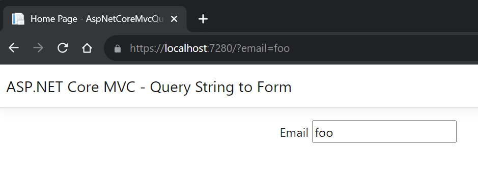

# ASP.NET Core MVC binding query string parameter and automatically populating the form

This is a simple ASP.NET Core MVC application showing how the framework takes values from the query string and uses them to automatically populate a form field on the same page.

## The Model (`Models/HomeIndexModel.cs`)

This is a simple `record` with one property, `Email`. This is bound to the lone textbox on the form.

```csharp
public record HomeIndexModel(string? Email);
```

## The Controller Action (`Controllers/HomeController.cs`)

The controller action takes a `string?` from the query string and binds it to the `email` parameter.

Note how we're ignoring this value and explicitly setting the view model's `Email` property to `null`.

```csharp
public IActionResult Index(string? email)
{
    // NOTE: Ignore the query string parameter and explicitly set the view model property to null.
    return View(new HomeIndexModel(Email: null));
}
```

## The View (`Views/Home/Index.cshtml`)

The view uses `HomeIndexModel` as its view model. It has a single form with a textbox for `HomeIndexModel`'s `Email` property.

```
@model AspNetCoreMvcQueryStringToForm.Models.HomeIndexModel
@{
    ViewData["Title"] = "Home Page";
}

<div class="text-center">
    
    <form>
        <label asp-for="Email"> Email
            <input type="email" asp-for="Email" />
        </label>
        
    </form>
</div>

```

## The Unexpected behavior

If I make a request to the action with an email query string parameter, the `Email` form field is automatically populated with that value, even though I'm explicitly setting the `Email` model property to null in the controller action:



## Question

How and why is this happening?